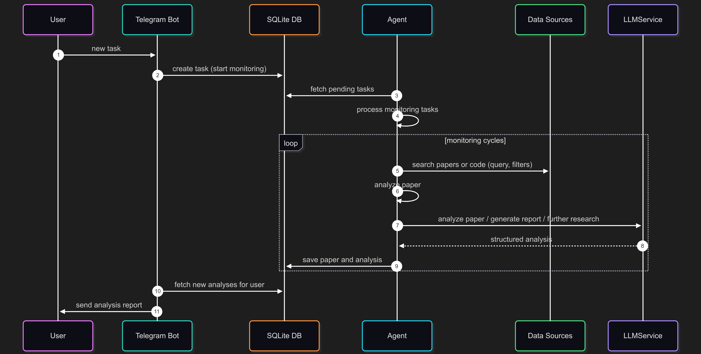

<div align="center">

# 🔬 Searcher Agent

<p align="center">
  <strong>AI assistant that solves your research tasks by searching arXiv</strong>
</p>

<p align="center">
 
 


</p>

<p align="center">
  <a href="#what-it-does">What It Does</a> •
  <a href="#quick-setup">Quick Setup</a> •
  <a href="#development">Development</a> •
  <a href="https://fresh-milkshake.github.io/searcher-agent/use-cases.html">Use Cases</a> •
  <a href="https://fresh-milkshake.github.io/searcher-agent/">Docs</a>
</p>

</div>

---

## What It Does

**Turns your goal into actionable findings** — you describe a task in natural language, the assistant plans queries, searches arXiv, ranks and analyzes papers, and sends you a concise report with the most useful items.

- Plans multiple search queries for your task
- Retrieves candidates from arXiv
- Ranks with BM25 over title + abstract
- Analyzes top items with an LLM or a local heuristic
- Decides whether it’s worth notifying you and composes a short report

Examples of tasks:

- “Find practical studies on vision transformers for medical imaging”
- “Summarize top benchmarks for small-context RAG”
- “Discover recent diffusion methods for texture generation”

<kbd>
  
</kbd>

---

## Quick Setup

<details>
<summary><strong>Prerequisites</strong></summary>

- Python 3.10+
- Telegram Bot Token ([create one](https://t.me/BotFather))
- OpenAI API Key or local LLM setup

</details>

### 1️⃣ Install Dependencies

```bash
# Install uv package manager (see docs: https://docs.astral.sh/uv/)
curl -LsSf https://astral.sh/uv/install.sh | sh

# Install project dependencies
uv sync
```

### 2️⃣ Configure Environment

Create `.env` file in the project root:

```ini
TELEGRAM_BOT_TOKEN=your-telegram-bot-token
OPENAI_API_KEY=your-openai-api-key
OPENROUTER_API_KEY=your-openrouter-key
DATABASE_PATH=database.db
AGENT_POLL_SECONDS=30
AGENT_DRY_RUN=0
AGENT_ID=main_agent
PIPELINE_USE_AGENTS_ANALYZE=1
```

### 3️⃣ Configure LLM

Choose your model in [`shared/llm.py`](shared/llm.py) by changing the `AGENT_MODEL` variable. You will need an API key for the model you choose (except for Ollama local models). You can also add your own models like this:

```python
_my_model_provider = AsyncOpenAI(
    base_url="https://api.my-model-provider.com/v1",
    api_key=os.getenv("MY_MODEL_API_KEY")
)

MyModel = OpenAIChatCompletionsModel(
    model="my-model",
    openai_client=_my_model_provider
)
```

See [`shared/llm.py`](shared/llm.py) for more examples.

### 4️⃣ Launch System

```bash
# 🚀 Start everything
uv run python main.py

# Or run components separately:
uv run python start_bot.py    # 🤖 Bot only
uv run python start_agent.py  # 🧠 Agent only

# Or run REST API only:
uv run python start_api.py    # 🌐 REST API on http://localhost:8000
```

---

## How to Use

### Create a Task (recommended)

```
/task "AI for medical imaging" Find practical studies, datasets, and evaluation results
```

### Bot Commands

<table>
<tr>
<th>Category</th>
<th>Command</th>
<th>Description</th>
<th>Example</th>
</tr>
<tr>
<td rowspan="6"><strong>Main</strong></td>
<td><code>/start</code></td>
<td>Help & commands</td>
<td>-</td>
</tr>
<tr>
<td><code>/task</code></td>
<td>Create a new autonomous search task</td>
<td><code>/task "Short title" Brief description</code></td>
</tr>
<tr>
<td><code>/status_task</code></td>
<td>List your tasks</td>
<td>-</td>
</tr>
<tr>
<td><code>/pause_task</code>, <code>/resume_task</code></td>
<td>Control a task by id</td>
<td><code>/pause_task 12</code></td>
</tr>
<tr>
<td><code>/status</code></td>
<td>Current system status</td>
<td>-</td>
</tr>
<tr>
<td><code>/history</code></td>
<td>Recent findings</td>
<td>-</td>
</tr>
<tr>
<td rowspan="6"><strong>Settings</strong></td>
<td><code>/settings</code></td>
<td>View current settings</td>
<td>-</td>
</tr>
<tr>
<td><code>/set_relevance</code></td>
<td>Set minimum relevance threshold</td>
<td><code>/set_relevance relevance 60</code></td>
</tr>
<tr>
<td><code>/set_notification</code></td>
<td>Set notification thresholds</td>
<td><code>/set_notification instant 80</code></td>
</tr>
<tr>
<td><code>/set_search_depth</code></td>
<td>Set search depth in days</td>
<td><code>/set_search_depth 14</code></td>
</tr>
<tr>
<td><code>/reset_settings</code></td>
<td>Reset to defaults</td>
<td>-</td>
</tr>
<tr>
<td><code>/set_group</code>, <code>/unset_group</code></td>
<td>Configure group notifications</td>
<td>-</td>
</tr>
</table>

#### Topics (optional)

For legacy topic-based monitoring you can still use:

- `/topic "target topic" "search area"`
- `/switch_themes`

### Group Chat Support

The bot supports **group chat notifications** - you can configure it to send all findings to a group chat instead of personal messages.

#### Setup Group Notifications

1. **Add bot to group chat**
2. **Use command in group**: `/set_group`
3. **All notifications will be sent to the group**

Use `/unset_group` to return notifications to your personal chat.

### Settings

The bot provides **fine-grained control** over analysis and notification parameters.

#### Relevance Threshold

Control how strict the analysis should be (0–100):

```bash
/set_relevance relevance 70
```

#### Notification Settings

Configure when you want to be notified:

```bash
/set_notification instant 80  # Instant notifications (≥80% relevance)
/set_notification daily 50    # Daily digest (≥50% relevance)
/set_notification weekly 30   # Weekly digest (≥30% relevance)
```

#### Reset to Defaults

```bash
/reset_settings 
```

---

## REST API

Start the API:

```bash
uv run python start_api.py
```

Health check:

```bash
curl http://localhost:8000/healthz
```

Run the pipeline:

```bash
curl -X POST http://localhost:8000/v1/run \
  -H "Content-Type: application/json" \
  -d '{
    "query": "AI for medical imaging",
    "categories": ["cs.CV"],
    "max_queries": 5,
    "bm25_top_k": 20,
    "max_analyze": 10,
    "min_relevance": 50.0
  }'
```

---

## Example Output

```
Findings for your task: AI for medical imaging

- Vision Transformers in Radiology
  Why useful for this task: addresses transformers, medical imaging, classification relevant to your task
  Link: https://arxiv.org/abs/XXXX.XXXXX

- Self-supervised pretraining for limited data MRI
  Why useful for this task: addresses pretraining, limited data, MRI relevant to your task
  Link: https://arxiv.org/abs/YYYY.YYYYY
```

---

## Development

- Run tests: `uv run pytest`
- Quick quality checks: `uv run python quality-check.py <target>`
- Build docs: `uv run sphinx-build -b html docs docs/_build/html`

## Documentation

- Full documentation: [searcher-agent docs](https://fresh-milkshake.github.io/searcher-agent/)

### Architecture (brief)

1. Strategy: generate queries from your task
2. Retrieval: arXiv search via `shared.arxiv_parser`
3. Ranking: BM25 over title + abstract
4. Analysis: LLM-based (or heuristic) relevance + summary
5. Decision: select top items and compose a concise report

## 📄 License

This project is licensed under the **MIT License**. See the [LICENSE](LICENSE) file for details.

---

<div align="center">

**Built by [fresh-milkshake](https://github.com/fresh-milkshake)**
<br>
Give this project a ⭐ if you found it useful!
  <br>
  <br>
  <a href="#-searcher-agent" style="font-size: 1.2em; color: white;">⬆️ Back to top</a>
</div>
