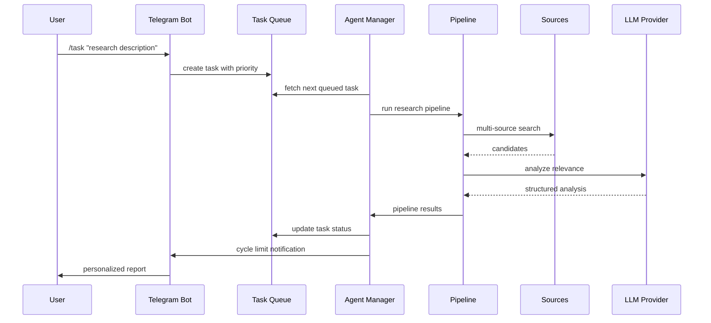

<div align="left">


</div>


<p align="center">
  <a href="#what-it-does">What It Does</a> •
  <a href="#architecture">Architecture</a> •
  <a href="#quick-setup">Quick Setup</a> •
  <a href="#usage">Usage</a> •
  <a href="https://privateai-com.github.io/research-ai/">Docs</a>
</p>

## Overview


**research-ai** — agentic research assistant that transforms your research goals into actionable insights through a sophisticated multi-stage pipeline that intelligently manages tasks, searches multiple sources, and delivers personalized results.

### Key Features

🎯 **Smart Task Management**
- Queue-based task processing with priority management
- Cycle-based execution with configurable limits per user plan
- Intelligent notifications when cycle limits are reached
- Automatic task status tracking and progress monitoring

🔍 **Multi-Source Intelligence**
- Automatic source selection per query (arXiv, Google Scholar, PubMed, GitHub)
- BM25 ranking over title + abstract for relevance scoring
- LLM-powered analysis with configurable relevance thresholds
- Structured result presentation with actionable insights

⚡ **User-Centric Experience**
- Free (5 cycles) and Premium (100 cycles) user plans
- Real-time progress tracking and status updates
- Group chat support for team collaboration
- Personalized notification preferences

### Example Tasks

- "Find practical studies on vision transformers for medical imaging"
- "Summarize top benchmarks for small-context RAG"
- "Discover recent diffusion methods for texture generation"



---

## Architecture

### Modular Design

```
research-ai/
├── agent/                # AI Agent System
│   ├── manager.py        # Task processing orchestrator
│   ├── pipeline/         # Research pipeline stages
│   └── browsing/         # Source-specific tools
├── bot/                  # Telegram Bot Interface
│   ├── handlers/         # Command handlers
│   └── notifications/    # Notification system
├── api/                  # REST API Interface
├── shared/               # Shared Components
│   ├── database/         # Modular Database Layer
│   │   ├── operations/   # Database operations
│   │   ├── models.py     # SQLAlchemy ORM models
│   │   └── enums.py      # Database enums
│   ├── llm.py            # LLM configuration
│   └── logging.py        # Centralized logging
└── tests/                # Test Suite
```

### Database Architecture

**Core Models:**
- `User` - User management with plan-based limits
- `UserTask` - Enhanced task model with queue support
- `TaskQueue` - Priority-based task processing queue
- `RateLimitRecord` - Anti-spam protection
- `TaskStatistics` - Processing metrics and analytics

**Agent Models:**
- `ResearchTopic` - Research topic management
- `ArxivPaper` - Paper storage and metadata
- `PaperAnalysis` - Relevance analysis results
- `UserSettings` - User preferences and thresholds

### Task Processing Flow

1. **Task Creation** → User creates task via bot/API
2. **Queue Management** → Task added to priority queue
3. **Agent Processing** → Agent picks next task from queue
4. **Pipeline Execution** → Multi-stage research pipeline
5. **Cycle Management** → Track cycles, notify on limits
6. **Result Delivery** → Personalized notifications to user

---

## Quick Setup

<details>
<summary><strong>Prerequisites</strong></summary>

- Python 3.10+
- Telegram Bot Token ([create one](https://t.me/BotFather))
- OpenAI API Key or local LLM setup

</details>

### 1️⃣ Install Dependencies

```bash
# Install uv package manager (see docs: https://docs.astral.sh/uv/)
curl -LsSf https://astral.sh/uv/install.sh | sh

# Install project dependencies
uv sync
```

### 2️⃣ Configure Environment

Create `.env` file in the project root:

```ini
# Bot Configuration
TELEGRAM_BOT_TOKEN=your-telegram-bot-token

# LLM Configuration
# if you have an API key for OpenAI:
# OPENAI_API_KEY=your-openai-key-here
# if you use OpenRouter provider:
# OPENAI_API_KEY=
OPENAI_API_KEY=your-openai-api-key
OPENROUTER_API_KEY=your-openrouter-key

# Database Configuration
DATABASE_URL=sqlite:///./database.db

# Agent Configuration
AGENT_POLL_SECONDS=30
AGENT_DRY_RUN=false
AGENT_ID=main_agent

# Pipeline Configuration
PIPELINE_USE_AGENTS_STRATEGY=1
PIPELINE_USE_AGENTS_ANALYZE=0
```

### 3️⃣ Configure LLM

Choose your model in [`shared/llm.py`](shared/llm.py) by changing the `AGENT_MODEL` variable. You will need an API key for the model you choose (except for Ollama local models). You can also add your own models like this:

```python
_my_model_provider = AsyncOpenAI(
    base_url="https://api.my-model-provider.com/v1",
    api_key=os.getenv("MY_MODEL_API_KEY")
)

MyModel = OpenAIChatCompletionsModel(
    model="my-model",
    openai_client=_my_model_provider
)
```

See [`shared/llm.py`](shared/llm.py) for more examples.

### 4️⃣ Launch System

```bash
# 🚀 Start everything
uv run python main.py

# Or run components separately:
uv run python start_bot.py    # 🤖 Bot only
uv run python start_agent.py  # 🧠 Agent only
uv run python start_api.py    # 🌐 REST API on http://localhost:8000
```

---

## Usage

### User Plans

**Free Plan:**
- 5 tasks per day
- 1 concurrent task
- 5 search cycles per task
- Basic notifications

**Premium Plan:**
- 100 tasks per day
- 5 concurrent tasks
- 100 search cycles per task
- Advanced notifications and analytics

### Bot Commands

<table>
<tr>
<th>Category</th>
<th>Command</th>
<th>Description</th>
<th>Example</th>
</tr>
<tr>
<td rowspan="6"><strong>Tasks</strong></td>
<td><code>/task</code></td>
<td>Create new research task</td>
<td><code>/task "AI for medical imaging"</code></td>
</tr>
<tr>
<td><code>/status</code></td>
<td>View task status and progress</td>
<td>-</td>
</tr>
<tr>
<td><code>/history</code></td>
<td>Browse task results</td>
<td>-</td>
</tr>
<tr>
<td><code>/pause_task</code></td>
<td>Pause specific task</td>
<td><code>/pause_task 123</code></td>
</tr>
<tr>
<td><code>/resume_task</code></td>
<td>Resume paused task</td>
<td><code>/resume_task 123</code></td>
</tr>
<tr>
<td><code>/cancel_task</code></td>
<td>Cancel running task</td>
<td><code>/cancel_task 123</code></td>
</tr>
<tr>
<td rowspan="5"><strong>Settings</strong></td>
<td><code>/set_notification</code></td>
<td>Configure notification thresholds</td>
<td><code>/set_notification instant 80</code></td>
</tr>
<tr>
<td><code>/set_group</code></td>
<td>Enable group notifications</td>
<td>-</td>
</tr>
<tr>
<td><code>/unset_group</code></td>
<td>Disable group notifications</td>
<td>-</td>
</tr>
<tr>
<td><code>/upgrade</code></td>
<td>Upgrade to Premium plan</td>
<td>-</td>
</tr>
<tr>
<td><code>/help</code></td>
<td>Show help and commands</td>
<td>-</td>
</tr>
</table>

### Task Lifecycle

1. **Creation** → Task added to queue with priority
2. **Processing** → Agent executes research pipeline
3. **Cycles** → Multiple search cycles (5 for Free, 100 for Premium)
4. **Completion** → Results delivered with cycle limit notification
5. **History** → Results available for review

### Cycle Limit Notifications

When a task reaches its cycle limit, users receive personalized notifications:

**With Results:**
```
🎉 Task #1 completed!
✅ Found results for your query
🔄 Cycles completed: 5/5 (Plan: Free)
🤖 Hope the results were helpful!
💡 Want to continue research?
• Create new task with refined query
• Or upgrade to Premium for unlimited cycles
```

**Without Results:**
```
🔄 Task #5 completed
📝 Your query description...
🔄 Cycles completed: 5/5 (Plan: Free)
❌ No results found for this query
💡 Recommendations:
• Try reformulating your query
• Use different keywords
• Or upgrade to Premium for more cycles
```

---

## REST API

Start the API:

```bash
uv run python start_api.py
```

Health check:

```bash
curl http://localhost:8000/healthz
```

Run the pipeline:

```bash
curl -X POST http://localhost:8000/v1/run \
  -H "Content-Type: application/json" \
  -d '{
    "query": "AI for medical imaging",
    "categories": ["cs.CV"],
    "max_queries": 5,
    "bm25_top_k": 20,
    "max_analyze": 10,
    "min_relevance": 50.0
  }'
```

---

## 📄 License

This project is licensed under the **MIT License**. See the [LICENSE](LICENSE) file for details.

---

<div align="center">

**Built by [fresh-milkshake](https://github.com/fresh-milkshake)**
<br>
Give this project a ⭐ if you found it useful!
  <br>
  <br>
  <a href="#overview" style="font-size: 1.2em; color: white;">⬆️ Back to top</a>
</div>
